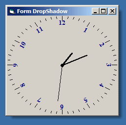



## XP Form Drop Shadow for All Platform \(Added ScreenShot\)

### Description

Adds Drop shadow effect to top level window, works for all windows platform as long as msimg32.dll is available (It's included in Win98 and above). This project use some works from Vlad Vissoultchev, Paul Caton, and a modified routine from www.vbaccelerator.com.

Comments and suggestions are welcome, and please vote if you like it.

The screenshot by the way is for my next update, I'm trying to create DropShadow for Irregular Window shape. I'll upload it as soon as it completed.
 
### More Info
 

             |
---                |---
**Submitted On**   |2003-12-28 05:19:08
**By**             |[Luthfi M](https://github.com/Planet-Source-Code/PSCIndex/blob/master/ByAuthor/luthfi-m.md)
**Level**          |Advanced
**User Rating**    |4.9 (44 globes from 9 users)
**Compatibility**  |VB 6\.0
**Category**       |[Graphics](https://github.com/Planet-Source-Code/PSCIndex/blob/master/ByCategory/graphics__1-46.md)
**World**          |[Visual Basic](https://github.com/Planet-Source-Code/PSCIndex/blob/master/ByWorld/visual-basic.md)
**Archive File**   |[XP\_Form\_Dr16873112272003\.zip](https://github.com/Planet-Source-Code/luthfi-m-xp-form-drop-shadow-for-all-platform-added-screenshot__1-50633/archive/master.zip)

